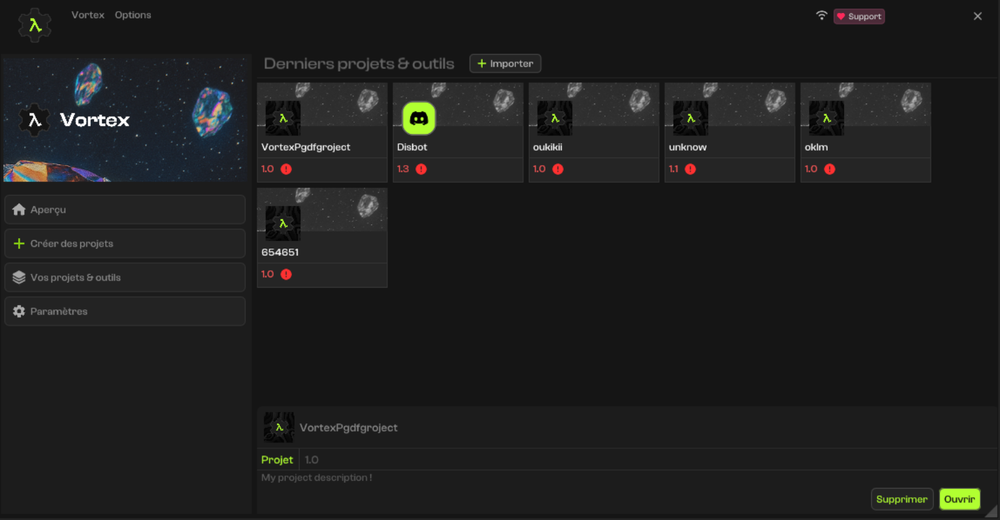
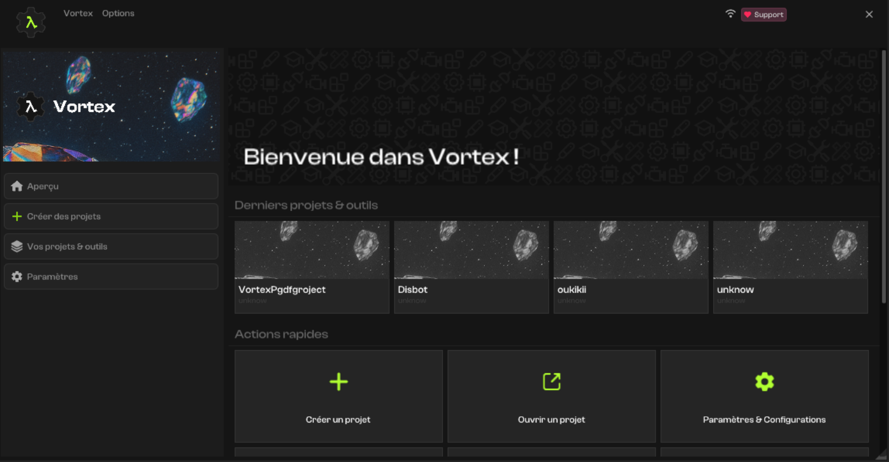
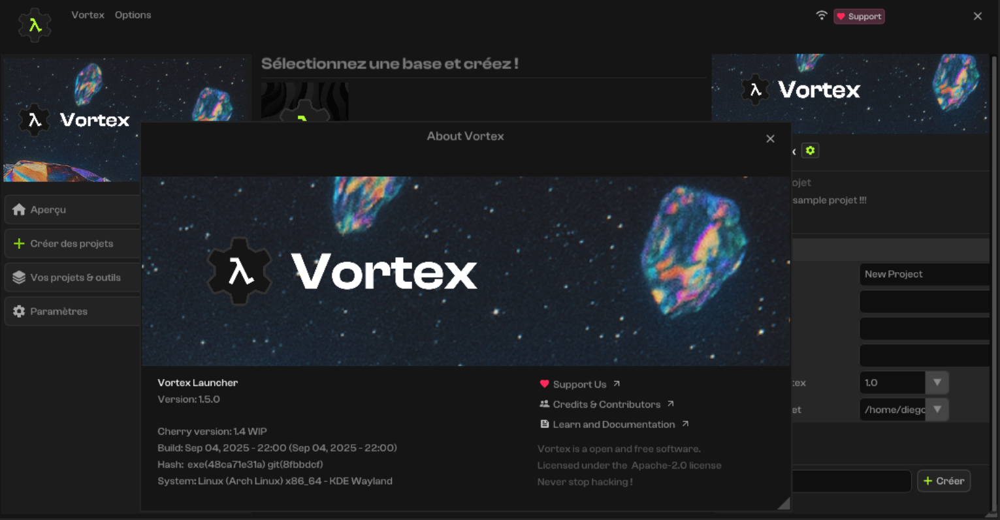

<a href="https://infinite.si">
  <h1 align="center">
    <picture>
      <source media="(prefers-color-scheme: dark)" srcset="./.github/imgs/main.png">
      
    </picture>
  </h1>
</a>

  
  
  
  
  
  

### What is Vortex Launcher ?
The Vortex Launcher is an easy-to-use tool that helps you create Vortex projects, manage your tools and projects, add content from the community, and share your own content too!

### What is *Vortex* ?
Vortex is a playground built by the Infinite community. It includes an editor, a launcher, and a content platform. It’s all about giving hackers the tools to hack, creators the freedom to create, and makers the space to build wild projects, mods, and services at the edge of cybersecurity, systems, apps, and the future of open technology!

<table align="center">
  <tr>
    <td align="center">
      
      
Project managment

    </td>
    <td align="center">
      
      
Welcome Window

    </td>
  </tr>
  <tr>
    <td align="center">
      
      
Overview

    </td>
  </tr>
</table>

### Features 
> - 🧰 **Create and manage** all of your Vortex projects, hacks & tools
> - 🧰 Get **latests versions** of Vortex
> - 🧰 Subscribe to **Research and Beta** programs
> - 🧰 Add ready to work **modules and plugins** for Vortex
> - 🧰 Add ready to use **templates & contents** for your projects
> - 🧰 [WIP] Access to a local **Documentation** of Vortex

### Compatibility

### License
The Vortex Launcher is licensed under the **Apache License 2.0** see [LICENSE](https://github.com/infiniteHQ/VortexLauncher/blob/main/LICENSE) for more information.

### Thanks

**The desktop application is made thanks to the** [**Cherry**](https://github.com/infiniteHQ/Cherry) **framework.**  
- Cherry uses the incredible library [ImGui from Ocornut and the community](https://github.com/ocornut/imgui). It uses [SDL](https://github.com/libsdl-org/SDL), Vulkan, [Spdlog](https://github.com/gabime/spdlog), [miniaudio](https://github.com/mackron/miniaudio), and [json from nlohmann](https://github.com/nlohmann/json)! A lot of thanks to these amazing works :)
